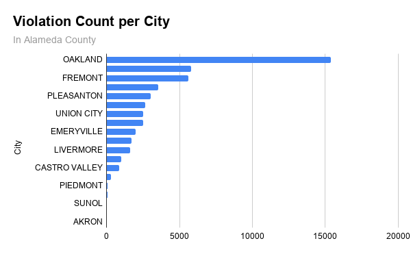
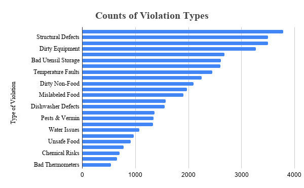
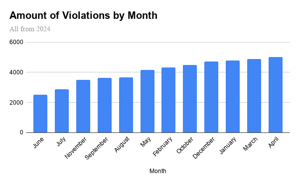

# Analysis of Alameda County's Food Safety Citations

## 1. The Data Source & Challenges

This dataset is derived from the **Alameda County Open Data Portal**, capturing food facility inspection violations issued by the *Alameda County Department of Environmental Health* in 2024.

From a data journalism standpoint, official public data must always be verified and questioned rather than accepted at face value. Here are some of the limitations and misreadings of the data:

* **The Population versus Permit Density Bias:** As you will soon see in the citations by city graph, certain cities show staggering numbers of citations compared to others. This does not automatically mean those cities have dirtier kitchens. This disparity between citations could come from cities having more restaurants. Cities with lower citations could be cities with more housing than restaurants, giving fewer opportunities for restaurants to have violations.
* **Inspector Discretion:** A rise in violations during certain periods or within specific municipal sectors can be caused by internal issues. For example, a higher quota could be set for the inspectors, leading to harsher inspections rather than a drop in restaurant hygiene.
* **Interpretation Risks:** The raw data entries have violations that bunch many different things together (e.g., `"Floors, walls and ceiling dirty"` or `"Adequate handwashing not available"`). These terms could have many meanings and leave out specifics, creating a margin of error for the data classification. 

**Original Data Source:** [Alameda County Food Inspection Dataset](https://data.acgov.org/datasets/e95ff2829e9d4ea0b3d8266aac37ff14_0/explore?location=37.677604%2C-122.008949%2C10)

---

## 2. Data Analysis

To better create the charts, here are some of the major data cleaning steps taken:

* **Cleaning Up Missing Data:** Blank cells with missing `Latitude` or `Longitude`, and entries without a valid `Facility_ID` were removed to prevent mathematical padding or skewing the total volume counts.
* **Standardizing and Re-formatting the Date System:** To make graphs with respect to time, we switched the `Activity_Date` column to a standardized `YYYY-MM-DD` data type.
* **Making a Month Column:** To build the *"Amount of Violations by Month"* visualization, a new calculated column titled `Month` was engineered using the formula `=TEXT(I2, "mmmm")` to create aggregatable buckets for monthly trend analysis.
* **Redoing Violation Labels:** The raw data featured messy phrases like `"Floors, walls andc"` or `"Adequate handw"`. A lookup array was used to replace these incomplete entries with clean, super short descriptions such as `"Structural Defects"` or `"Blocked Hand Sinks"`. 

**Analysis Documentation:** [(https://docs.google.com/spreadsheets/d/13IPZhFZvWloGSTxz-4ZWt8_fLGqdBVV8vqxSQt6nZHw/edit?gid=1006609462#gid=1006609462)]

---

## 3. Visualizing the Findings

### Chart 1: Total Documented Food Violations by City

* **Caption:** This chart maps out the raw volume of food safety citations across Alameda County municipalities. Oakland significantly leads the dataset with over 15,000 logged citations, followed by Hayward and Fremont, which both have around 5,500. This chart shows us that more urban areas like Oakland, with higher amounts of permits, have a higher number of citations. Meaning that they could have the same or less percentage of citations as other cities, but because we are only looking at the raw number, we see that Oakland has the most citations. 
* **Source:** Alameda County Department of Environmental Health.

### Chart 2: Pervasiveness of Specific Violation Types

* **Caption:** By combining very similar citation labels and using only citations that have higher than 500 citations, we can clean the raw dataset’s text and put in our own short labels to make it easier to identify what the citation is. This chart illustrates that minor structural defects (3,782 instances), dirty preparation surfaces (3,500 instances), and dirty equipment (3,496 instances) represent the vast majority of county citations. While serious chemical or thermometer issues remain relatively rare. 
* **Source:** Alameda County Department of Environmental Health.

### Chart 3: Volume of Logged Citations Grouped by Month

* **Caption:** An overview of citation volume across 2024, sorted by ascending total count. June recorded the fewest infractions at roughly 2,500, while April recorded the highest volume, nearly doubling that total with roughly 5,000 entries. 
* **Source:** Alameda County Department of Environmental Health.

---

## 4. Narratives We Can Follow Based on the Analysis

### Narrative 1: Inspectors giving citations to fulfill a quota
The issue that most restaurants across the county had was minor structural defects, dirty preparation surfaces, and dirty equipment. Minor wear-and-tear is almost impossible to stop for commercial kitchens. These infrastructure maintenance issues are much less of a danger than threats like food contamination and toxin mismanagement. This idea could lead to a story of health inspectors fulfilling a quota by using small infractions to make restaurants pay fines, which shows us that there is a much larger problem in the system of these inspections. 

### Narrative 2: School Cafeteria Infractions causing public outcry
The raw data shows not only private, commercial restaurants but also public places such as public school cafeterias. Specifically, Glenmoor Elementary in Fremont and Harder Elementary in Hayward were faced with citations in October of 2024 about unsafe infrastructure, poor handwashing accessibility, and improper temperature readings. These citations could cause a big uproar in the community and cause parents to launch complaints at the school for not passing the inspections. 

### Narrative 3: Major difference in the number of citations in certain months
From Chart 3, we can see that there is a big gap between some months of inspection periods. June and July log the fewest violations all year, starting around 2,500. In contrast, high months like April nearly double that amount, hitting 5,000. This massive spring spike could be a cause of county inspections having a higher quota, like from the previous narrative, not a sudden influx of dirtier kitchens.

---

## 5. Ethical Concerns, Limitations, and Summary

Our main method of making graphs and analysis was using Pivot Tables and the `COUNTA` column in Google Sheets. This lets us aggregate the raw data from the CSV file. 

Without analysis, we can see that Alameda County's inspection dataset is a good way for tracking restaurant violations, but there are some limitations or ethical concerns, such as:
* Showing raw citation totals can be used unfairly to scare off consumers from independent businesses that can’t afford to lose their customer base, even if their violations were corrected immediately. Large fast-food chains can easily pay off these fines and negative press, while smaller, independently owned shops could be very hurt by this. 
* Public school cafeteria infractions are causing unnecessary panic and outrage from parents without getting to the root cause, such as a lack of funding in that school district. 
* Some people might read the graphs and be afraid to eat in places such as Oakland as they believe they have ‘dirtier kitchens’ because they have the highest amount of citations. 

To combat these ethical concerns or limitations, it is best to research more and get more information before jumping to conclusions about any of the restaurants or cities. Some of these steps to get more information could be:
1. Reaching out to local businesses to verify if their follow-up inspections were passed and if corrections were implemented.
2. Interviewing administrators at the Fremont and Hayward school districts to investigate why public elementary school facilities faced handwashing and temperature management citations.
3. Creating a "violations per food permit" graph to better show the number of restaurants receiving citations to get a better understanding of which cities have the highest rate of violations.

### Summary
In summary, this project shows the uses and narratives that can be formed from this data set. Such as how the Alameda County food violations mostly come from minor kitchen maintenance issues and not major health risks. Or big cities like Oakland have the highest number of citations simply because they have more restaurants. Ultimately, raw numbers don’t tell a full story; we need to follow up with interviews to get more context on the situations and combine more datasets to get a better picture of what is really going on. This context is vital to protect businesses, schools, and other restaurants from unfair panic.
